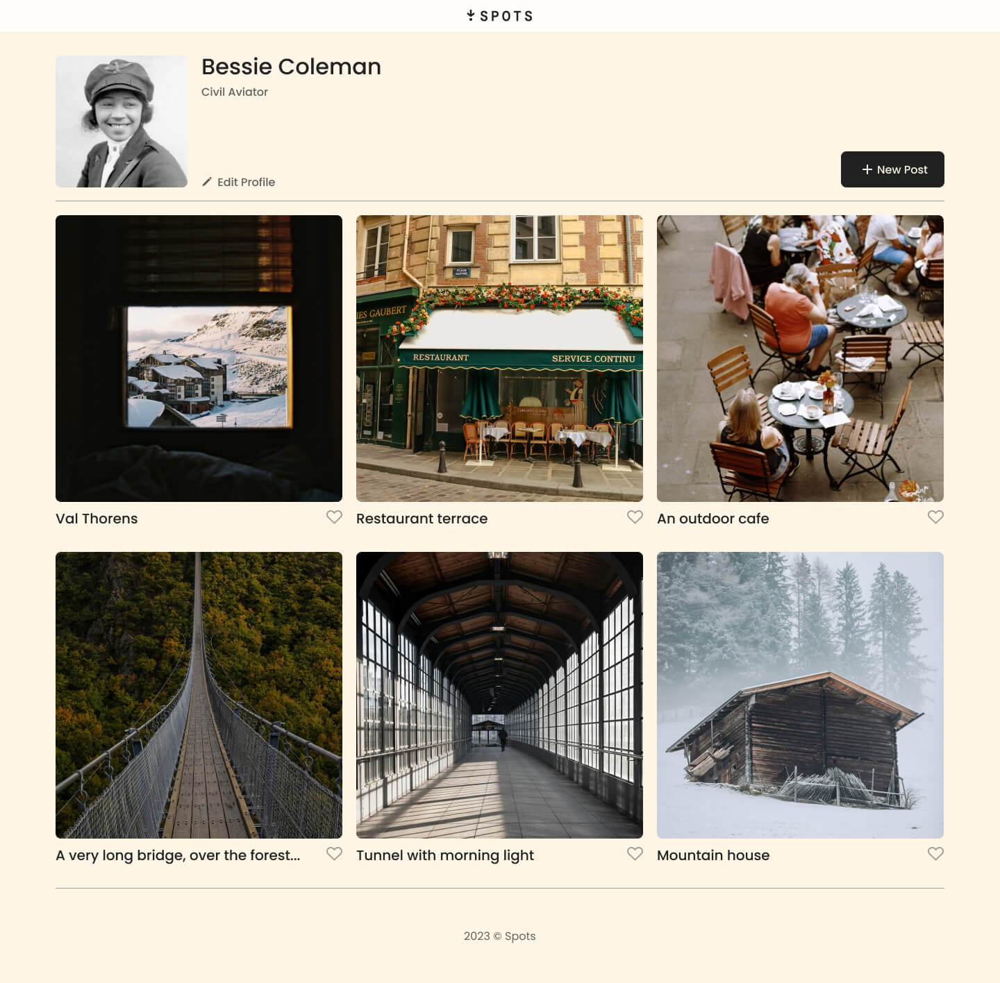
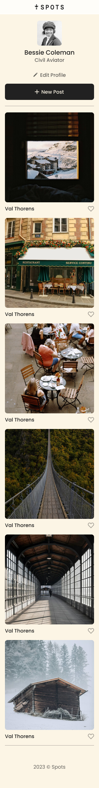

# Project 3: Spots

Spots is a dynamic image-sharing platform designed to connect people through captivating visuals.

### Overview

- Description
- Figma
- Images

**Description**

Spots is an image-sharing platform designed with responsive web design at its core, ensuring a seamless experience across various popular screen sizes. Whether you're browsing on a desktop, tablet, or smartphone, Spots adapts fluidly to provide an intuitive and visually appealing interface.

Built with modern web technologies, Spots allows users to effortlessly upload, share, and explore high-quality images while maintaining a user-friendly and accessible design. The platform prioritizes scalability, performance, and accessibility, making it a great solution for photographers, artists, and anyone looking to share visual content.

**Tech Stack**

- HTML
- CSS
- Responsive Design

**Figma**

- [Link to the project on Figma](https://www.figma.com/file/BBNm2bC3lj8QQMHlnqRsga/Sprint-3-Project-%E2%80%94-Spots?type=design&node-id=2%3A60&mode=design&t=afgNFybdorZO6cQo-1)

**Images**

**Video Tour**

- [Spots Webpage Tour](https://drive.google.com/file/d/11efWkMSqddWso_U0V3hr2dUPH2g0dj5Z/view?usp=sharing)

**Deployment**

This webpage is deployed to Github pages

- [Deployment Link](https://savannahsirois.github.io/se_project_spots/)
